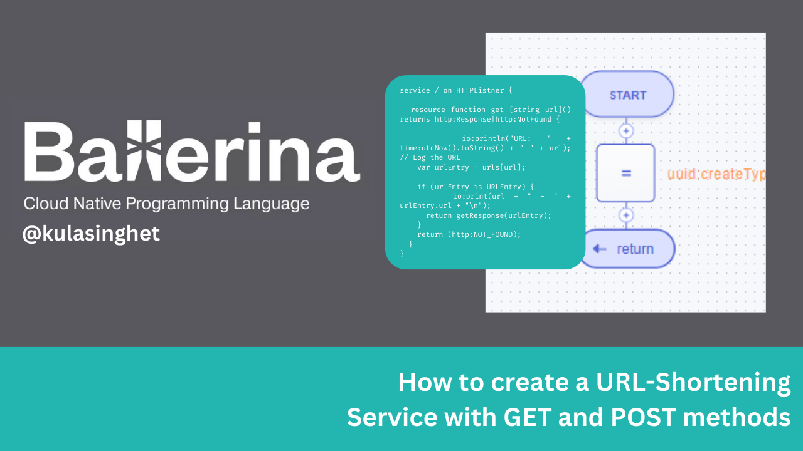

# URL Shortening Services - Ballerina 



This Ballerina code represents a simple URL shortening service. It allows you to create shortened versions of URLs and retrieve them for redirection. Let's break down the code step by step.

## Imported Packages

The Ballerina code for the URL shortening service imports and uses several packages to provide essential functionality. Below are the imported packages and how they are utilized in the code:

### 1. `ballerina/http`

- **Import Statement:** `import ballerina/http;`
- **Usage:**
  - This package is essential for handling HTTP requests and responses.
  - It allows the creation of HTTP listeners and the routing of incoming HTTP requests to appropriate resources.
  - The `http:Response` objects are used for constructing HTTP responses with status codes, payloads, and headers.

### 2. `ballerina/io`

- **Import Statement:** `import ballerina/io;`
- **Usage:**
  - The `io` package is used for input/output operations, such as printing log messages to the console.
  - It plays a critical role in debugging and logging, where information about requests, responses, and other relevant data is logged.

### 3. `ballerina/time`

- **Import Statement:** `import ballerina/time;`
- **Usage:**
  - The `time` package provides functionality for working with time-related operations.
  - In the code, it is used to capture the current time when logging the requested URL.
  - The `time:utcNow()` function retrieves the current UTC time.

### 4. `ballerina/uuid`

- **Import Statement:** `import ballerina/uuid;`
- **Usage:**
  - The `uuid` package is utilized to generate unique IDs, often used for short URL mappings.
  - The `uuid:createType4AsString()` function creates a random UUID, and the first 6 characters are extracted to generate a unique ID.

### 5. `string:RegExp`

- **Usage:**
  - The `string:RegExp` type represents a regular expression.
  - It is employed for URL validation in the `URLCreateDTO` before adding URLs to the storage table.
  - The `regex.isFullMatch(urlCreateDTO.url)` method checks if the URL adheres to the specified regular expression pattern.

These imported packages collectively provide the necessary functionality for handling HTTP requests, logging, time operations, generating unique IDs, and validating URLs. They are integral to the functionality of the URL shortening service.

## Types we use

The URL shortening service uses several types to represent the data it handles. Below are the types used in the code and their purposes:

### 1. `URLCreateDTO`

```ballerina
type URLCreateDTO readonly & record {
    string url;
};
```

- **Usage:**
  - The `URLCreateDTO` type is used to represent the data sent in the request body when creating a shortened URL.
  - It is a record type with a single field, `url`, which is a string.
  - The `readonly` keyword indicates that the record is immutable.
  - The `&` operator is used to specify that the record is a subtype of the `readonly` type.
  - The `record` keyword is used to define a record type.
  - The `string` type represents a string value.


### 2. `URLEntry`

```ballerina
type URLEntry readonly & record {
    readonly string id;
    string url;
};
```

- **Usage:**
  - The `URLEntry` type is used to represent the data stored in the URL storage table.
  - It is a record type with two fields, `id` and `url`, both of which are strings.
  

---

# How to create the URL shortening service

## Step 1 - We need to create a Ballerina project

Create a new folder named `url-shortening-service` and navigate to it using the terminal. Then create a file named `shortening_service.bal` inside the folder.

## Step 2 - We need to create a temporary storage table

The URL shortening service requires a temporary storage table to store the shortened URLs. The table is created using the `table` keyword, and the `key` keyword is used to specify the primary key. The `URLEntry` type is used to define the table's schema.

```ballerina
table<URLEntry> key(id) urls = table [
    {id: "ads45s", url: "https://ballerina.io"},
    {id: "sdf45s", url: "https://ballerina.io/learn/api-docs/ballerina/http.html"},
    {id: "xyz123", url: "https://example.com"}
];
```
## Step 3 - We need to create a HTTP listener

The URL shortening service requires a HTTP listener to listen for incoming HTTP requests. The `http:Listener` type is used to define the listener, and the `http:ListenerConfig` type is used to configure the listener. The `http:ListenerConfig` type is a record type with a single field, `port`, which is an integer. The `http:Listener` type is a subtype of the `http:ListenerConfig` type.

```ballerina
listener http:Listener HTTPListner = new (9090);
```

## Step 4 - We need to create a resource to handle POST requests to create shortened URLs

```ballerina
service /api on HTTPListner {
    resource function post addURL(URLCreateDTO urlCreateDTO) returns http:Response {

        // Create a response
        http:Response response = new;

        // Validate the URL
        if (urlCreateDTO.url == "") {
            response.statusCode = 400; // 400 Bad Request
            response.setPayload("URL cannot be empty");
            return response;
        }

        // Validate the URL using a regex pattern
        // This regex pattern is taken from https://stackoverflow.com/a/3890175/12919712
        string:RegExp regex = re `((https?|ftp|smtp)://)?(www\.)?[a-zA-Z0-9]+(\.[a-z]{2,}){1,3}(\?[a-zA-Z0-9-_%]+=[a-zA-Z0-9-_%]+&?)*$`;

        if (!regex.isFullMatch(urlCreateDTO.url)) {
            response.statusCode = 400; // 400 Bad Request
            response.setPayload("Invalid URL");
            return response;
        }

        // Check if the URL already exists in the urls table
        foreach URLEntry urlentry in urls {
            if (urlentry.url === "http://" + urlCreateDTO.url) {
                response.statusCode = 200; // 200 OK
                response.setPayload(urlentry.toJson());
                return response;
            }
        }

        string id = generateRandomString();
        string url = "http://" + urlCreateDTO.url;

        if (id == "") {
            response.statusCode = 500; // 500 Internal Server Error
            response.setPayload("Error generating ID");
            return response;
        }

        // Create a new URLEntry record
        URLEntry urlEntry = {id: id, url: url};

        // Add the URL to the table
        urls.add(urlEntry);

        response.statusCode = 201; // 201 Created
        response.setPayload(urlEntry.toJson());

        return response;
    }

    // TODO: Implement the getURLs resource
  
}
```

Let's break down the code step by step.

### 1. Create a new service named `/api` on the `HTTPListner` listener

Our application should listen for incoming HTTP requests on the `/api` path. The `service` keyword is used to define a service, and the `on` keyword is used to specify the listener. 

```ballerina
service /api on HTTPListner {
    // ...
}
```

### 2. Create a resource to handle POST requests to create shortened URLs

The URL shortening service should allow users to create shortened URLs by sending a POST request to the `/api` path. The `resource` keyword is used to define a resource, and the `post` keyword is used to specify that the resource handles POST requests. The `addURL` resource takes a `URLCreateDTO` object as a parameter and returns a `http:Response` object.

```ballerina
resource function post addURL(URLCreateDTO urlCreateDTO) returns http:Response {
    // ...
}
```

### 3. Implement the resource

We first create a `http:Response` object to send a response to the client.

```ballerina
http:Response response = new;
```

Then we validate the URL sent in the request body. If the URL is empty, we set the response status code to `400` and set the response payload to `URL cannot be empty`.

```ballerina
if (urlCreateDTO.url == "") {
    response.statusCode = 400; // 400 Bad Request
    response.setPayload("URL cannot be empty");
    return response;
}
```

Next, we validate the URL using a regular expression pattern. If the URL does not match the pattern, we set the response status code to `400` and set the response payload to `Invalid URL`.

```ballerina
// Validate the URL using a regex pattern
        // This regex pattern is taken from https://stackoverflow.com/a/3890175/12919712
        string:RegExp regex = re `((https?|ftp|smtp)://)?(www\.)?[a-zA-Z0-9]+(\.[a-z]{2,}){1,3}(\?[a-zA-Z0-9-_%]+=[a-zA-Z0-9-_%]+&?)*$`;

        if (!regex.isFullMatch(urlCreateDTO.url)) {
            response.statusCode = 400; // 400 Bad Request
            response.setPayload("Invalid URL");
            return response;
        }
```

Then we check if the URL already exists in the `urls` table. If the URL exists, we set the response status code to `200` and set the response payload to the URL entry in the table.

```ballerina
// Check if the URL already exists in the urls table
        foreach URLEntry urlentry in urls {
            if (urlentry.url === "http://" + urlCreateDTO.url) {
                response.statusCode = 200; // 200 OK
                response.setPayload(urlentry.toJson());
                return response;
            }
        }
```

If the URL does not exist in the table, we generate a random string to use as the ID for the shortened URL. If the ID is empty, we set the response status code to `500` and set the response payload to `Error generating ID`.

```ballerina
string id = generateRandomString();
        string url = "http://" + urlCreateDTO.url;

        if (id == "") {
            response.statusCode = 500; // 500 Internal Server Error
            response.setPayload("Error generating ID");
            return response;
        }
```

Then we create a new `URLEntry` record using the generated ID and the URL sent in the request body.

```ballerina
// Create a new URLEntry record
        URLEntry urlEntry = {id: id, url: url};
```

Finally, we add the URL to the `urls` table and set the response status code to `201` and set the response payload to the URL entry in the table.

```ballerina
// Add the URL to the table
        urls.add(urlEntry);

        response.statusCode = 201; // 201 Created
        response.setPayload(urlEntry.toJson());

        return response;
```

### 4. Implement the `generateRandomString` function

For the `generateRandomString` function, we use the `uuid:createType4AsString()` function to generate a random UUID and extract the first 6 characters to use as the ID for the shortened URL.

```ballerina
function generateRandomString() returns string {
    string uuid = uuid:createType4AsString();
    return uuid[0...6];
}
```

### Step 5 - We need to create a resource to handle GET requests to retrieve shortened URLs

```ballerina
  resource function get getURLs() returns http:Response {
        http:Response response = new;
        response.statusCode = 200; // 200 OK
        response.setPayload(urls.toJson());
        return response;
    }
```

Let's break down the code step by step. We first create a `http:Response` object to send a response to the client. Then we set the response status code to `200` and set the response payload to the `urls` table.


### Step 6 - Magic function that generates the shortened URL

```ballerina
service / on HTTPListner {

    resource function get [string url]() returns http:Response|http:NotFound {

        io:println("URL: " + time:utcNow().toString() + " " + url); // Log the URL
        var urlEntry = urls[url];

        if (urlEntry is URLEntry) {
            io:print(url + " - " + urlEntry.url + "\n");
            return getResponse(urlEntry);
        }
        return (http:NOT_FOUND);
    }
}
```

I believe this is the most interesting part of the code. Let's break it down step by step.

First we have path variable `url` which is the shortened URL. This is the URL that the user will use to access the original URL.

```ballerina 
resource function get [string url]() returns http:Response|http:NotFound {
    // ...
}
```
This path variable is created by Ballerina using the `[]` operator. The `[]` operator is used to specify path variables in Ballerina. The path variable is then passed as a parameter to the resource function.

The `http:Response|http:NotFound` return type indicates that the resource function returns either a `http:Response` object or a `http:NotFound` object. The `http:NotFound` object is used to return a `404 Not Found` response.

Next we log the requested URL using the `io:println()` function. The `time:utcNow()` function is used to retrieve the current UTC time.

```ballerina
io:println("URL: " + time:utcNow().toString() + " " + url); // Log the URL
```

Then we retrieve the URL entry from the `urls` table using the shortened URL. If the URL entry exists, we return a `http:Response` object with the original URL as the payload. If the URL entry does not exist, we return a `http:NotFound` object.

```ballerina
var urlEntry = urls[url];

        if (urlEntry is URLEntry) {
            io:print(url + " - " + urlEntry.url + "\n");
            return getResponse(urlEntry);
        }
        return (http:NOT_FOUND);
```

The `getResponse` function is used to create a `http:Response` object with the original URL as the payload.

```ballerina
function getResponse(URLEntry urlEntry) returns http:Response {
    http:Response response = new;
    response.statusCode = 302; // 302 status code indicates a temporary redirect
    response.setHeader("Location", urlEntry.url); // Set the location header to the URL
    return response;
}
```

In the `getResponse` function, we first create a `http:Response` object. Then we set the response status code to `302`, which indicates a temporary redirect. Finally, we set the `Location` header to the original URL and return the response.

What happens in the browser when user access the shortened URL?

It will redirect to the original URL. For example, if the user accesses `http://localhost:9090/xyz123`, the browser will redirect to `https://example.com`.

---

# How to run the URL shortening service

## Step 1 - We need to compile the Ballerina code

Navigate to the `url-shortening-service` folder using the terminal and run the following command to compile the Ballerina code:

```bash
$ ballerina build shortening_service.bal
```

## Step 2 - We need to run the executable

Run the following command to run the executable:

```bash
$ bal.bat run shortening_service.bal
```

Please note that the command may differ depending on your operating system. This is for Windows OS.

## Step 3 - We need to test the URL shortening service

### 1. Create a shortened URL

Run the following command to create a shortened URL:

```bash
$ curl -X POST -d '{"url": "example.com"}' -H "Content-Type: application/json" http://localhost:9090/api
```

The response should be similar to the following:

```json
{"id":"xyz123","url":"http://example.com"}
```

### 2. Run the shortened URL

In the browser, navigate to `http://localhost:9090/xyz123`. The browser should redirect to `https://example.com`.


Congratulations! You have successfully created a URL shortening service using Ballerina. For more information on the topics discussed in this guide, see the [Ballerina documentation](https://ballerina.io/).

---

### Full code

Check out my GitHub repository for the full code of the URL shortening service.  [GitHub Repo](https://github.com/kulasinghet/URL-Shortening-Service-with-Ballerina)